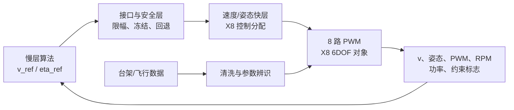
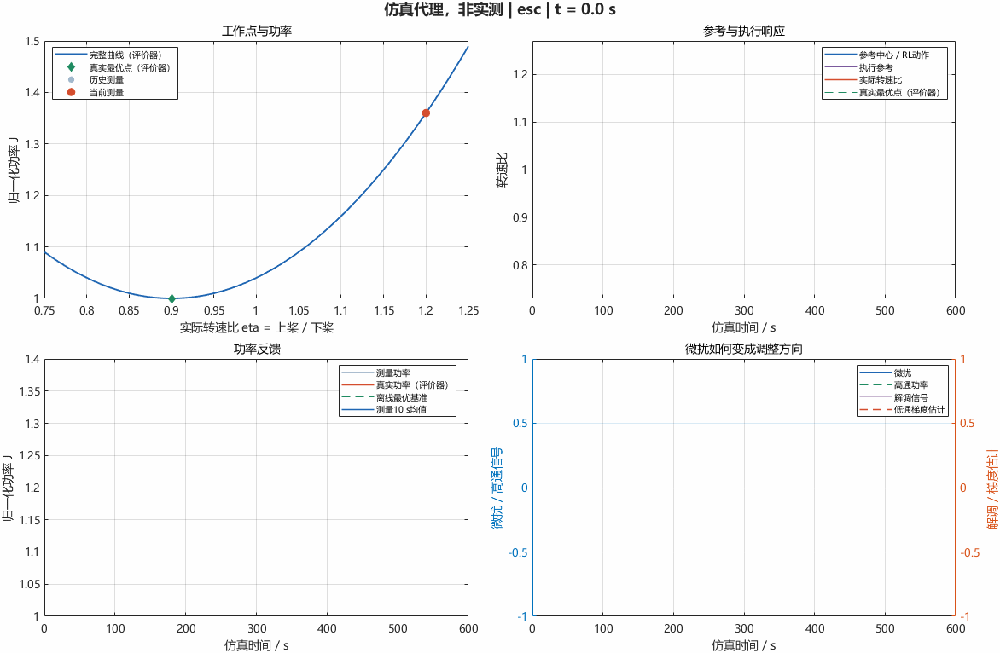

# 26isip_Aerospace

共轴八旋翼在线能耗优化协作仓库。

仓库包含**优化算法线**的六个可运行模块、**统一指标层**与**验证平台线**：上下桨转速比在线极值寻优（`ratio_esc`）、平飞速度在线极值寻优（`speed_esc`）、速度基线之上的 TD3 残差修正（`speed_rl_residual`）、平移曲线黑箱直搜（`speed_shift_search`）、崎岖多峰滤波全局寻优（`speed_rugged_search`）、任务1+2整合的统一速度寻优程序（`unified_search`），统一 MOP/MOE 指标与场景入口（`harness`），以及用于把慢层算法安全接入飞控快层的 `models/px4_x8`。所有模块当前都使用明确标注的**虚拟/代理功率对象**：它们不是实机飞控、不是电子调速器（ESC），也不构成真实 X8 节能率或偏航稳定性结论。

## 技术路线：四个模块的关系

```text
第 1 层  转速比 ESC      ratio_esc            优化 η = Ωu/Ωl（恒推力代理）        已完成验收
第 2 层  平飞速度 ESC    speed_esc            优化 v_ref（η=1，虚拟功率曲线）      已完成验收（算法线）
第 2+ 层 速度直搜研究    speed_shift_search   平移曲线瞬时跳变黑箱直搜（任务1）     已完成验收（研究线）
第 2+ 层 速度直搜研究    speed_rugged_search  崎岖多峰滤波全局寻优（任务2）         已完成验收（研究线）
第 2+ 层 整合研究程序    unified_search       任务1+2整合+能耗感知+MOP/MOE评价      已完成验收（研究线）
第 3 层  残差速度 RL     speed_rl_residual    v_ref = guard(v_base + Δv)，TD3      代理对象预研
第 4 层  平台接入        models/px4_x8        慢层算法安全接入飞控快层             M0-A/B/C/M1/M2 完成，下一步 M3
指标层  MOP/MOE        harness              统一场景、评价窗与能耗效能指标        已实现（代理口径）
```

- 第 1、2 层是两个单变量 ESC：优化变量不同（η 与 v），代理对象与验收口径相互独立，结论不可互相搬用。
- 第 3 层在第 2 层基线之上叠加学习残差，应对不规则风场工况；属于算法线预研，不接入平台。
- 第 4 层是验证平台线：M0-C 已按 `docs/interfaces/M0C_SPEED_ESC.md` 将 `ratio_esc` 内核作速度语义映射后接入；`speed_esc` 的回归估计器是后续内核替换候选。`speed_esc` 与 `speed_rl_residual` 尚未接入平台。



## 快速开始

环境要求：MATLAB R2022b；运行 Simulink 模型需要 Simulink；运行 RL 接口需要 Reinforcement Learning Toolbox。

```matlab
% 转速比 ESC（第一个模块）
cd modules/ratio_esc
START_HERE                 % 打开中文交互演示面板
run_demo                   % 导出A--E阶段的结果图和动画
run_acceptance             % 运行自动验收并写出实际报告
qa_ui                      % 检查交互面板、播放、暂停与导出

% 平飞速度 ESC
cd ../speed_esc
START_HERE                 % 中文面板（V1静态/V2速度响应/V3噪声延迟变化）
run_speed_demo             % 两类曲线×三版本与解调对照
run_speed_acceptance       % 单元、Python复现、Simulink一致性与74场景性能验收
qa_speed_ui                % 面板回调与截图检查

% 残差速度 RL
cd ../speed_rl_residual
START_HERE                 % 圆周+正弦风接口演示（不训练）
run_checks(false)          % 单元测试、适配器契约与20个不规则风种子
run_checks(true)           % 额外执行1回合TD3训练冒烟

% 平移曲线黑箱直搜（速度优化任务1）
cd ../speed_shift_search
START_HERE                 % 动画面板：黄金分割/Brent+平移监测重夹逼
run_task1_acceptance       % 144幕算法横评验收
tests_task1                % 16项单元测试

% 崎岖多峰滤波全局寻优（速度优化任务2）
cd ../speed_rugged_search
START_HERE                 % 动画面板：扫描+SG滤波+pattern search+对称顶点
run_task2_acceptance       % 滤波研究+算法消融+无偏移门槛验收
tests_task2                % 13项单元测试

% 统一速度寻优程序（任务1+2整合 + MOP/MOE）
cd ../unified_search
START_HERE                 % 动画面板(tracker/esc 2选1)+日志栏+验收报告载入
run_unified_acceptance     % 8项门槛 + 1小时窗MOE横比
tests_unified              % 13项单元测试

% 统一指标层 MOP/MOE
cd ../../harness
run_harness                % 三模块接线测试 + 1小时窗五算法MOE横比
```

## 当前成果

### 转速比 ESC（modules/ratio_esc）

- 上下桨转速比定义为 `eta = Omega_upper / Omega_lower`，默认测试范围为 `[0.75, 1.25]`。
- 完成静态对象、固定参考反馈、微扰观察、完整在线ESC和RL环境接口五个阶段。
- 完成MATLAB离散实现与原生Simulink离散模型的一致性验证。
- 完成12项单元测试和35组验收场景：无噪声三初值、2%测量噪声、0.5 s延迟、工况变化及RL完整回合。
- 已验证的代理模型结果：2%噪声叠加0.5 s延迟时10个随机种子均通过3%最终超额功率阈值；具体口径见 [验收报告](docs/evidence/acceptance-report.md)。

### 平飞速度 ESC（modules/speed_esc，2026-09-01 并入）

- 整合同事 Python 速度寻优方案（V1 静态 / V2 一阶速度响应 / V3 噪声+延迟+最优速度跳变）与转速比工程，只优化平飞速度、配比固定 1。
- 梯度估计以**窗口最小二乘回归**为主（约一个微扰周期）、经典同频解调为对照；关键修正包括功率-速度-时间三元组 FIFO 配对与完整窗口预热。
- 14 项单元测试、14 组原 Python 逐样本复现（最大误差 5.33e-15）、6 组 Simulink 一致性（最大差 1.25e-14）通过；正式种子 74 场景功率指标 74/74、速度定位 63/74（未达标场景如实列出）。
- 证据见 [docs/evidence/speed_esc/](docs/evidence/speed_esc/)。

### 残差速度 RL（modules/speed_rl_residual，2026-09-01 并入）

- 以速度基线（固定值 / ESC / 解析式）为底层，TD3 学习 `[-3,3] m/s` 残差，策略外 guard 硬约束（边界 `[2,15] m/s`、限速、反馈失效冻结）。
- 不规则风场（OU 有色噪声+阵风）、电池模型与直线/圆周轨迹代理；观测仅由带时间戳/噪声/延迟/有效标志的测量构成，真值只给评价器。
- 11 项单元测试与适配器契约通过；20 个未见不规则风种子零硬约束违规；可观测风解析残差 19/20 种子优于固定基准（约 -1.25% 代理功率）；TD3 候选恒定风 -3.02%、不规则风尚未胜出（0–1/20，如实记录为训练起点）。
- 证据见 [docs/evidence/speed_rl_residual/](docs/evidence/speed_rl_residual/)。

### 平移曲线黑箱直搜（modules/speed_shift_search，2026-09-01 并入）

- 速度优化任务1：曲线上下左右平移、速度可瞬时跳变的黑箱搜索；推荐方案 tracker = Brent 混合搜索 + 锁定 + 斜率迟滞双阈值平移监测重夹逼。
- 六算法横评（网格/三分/黄金/Brent/tracker/ESC）：静态场景 tracker 6 次评估入带；dx 跳变 9–20 步恢复；纯上下平移零误触发；跳变场景全程能耗 0.21%（ESC 0.64%、网格 19.7%）。
- 16 项单元测试、8 项 tracker 性能门槛全过；搜索能耗开关（续航纪录口径）两档均评估。证据见 [docs/evidence/speed_shift_search/](docs/evidence/speed_shift_search/)。

### 崎岖多峰滤波全局寻优（modules/speed_rugged_search，2026-09-01 并入）

- 速度优化任务2：调试二次曲线基准 + 绕 v=6 对称负余弦崎岖项（7 个局部谷，全局最优精确在 6，无平移）+ 相对噪声；推荐方案 multistart = 均匀扫描 → 中心对称 Savitzky-Golay 滤波选谷 → pattern search 重定位 → 对称 stencil 最小二乘抛物线顶点（无偏定位）。
- "无偏移"量化验收：20 种子全局命中 100%、跨种子系统偏置 −0.044 m/s（门槛 ±0.05）；滤波研究 25 组（5 法×5 窗）给出结构偏置/噪声残差数据；2% 噪声压力场景精度极限如实记录（约 ±0.46 m/s）。
- 13 项单元测试、6 项性能门槛全过。证据见 [docs/evidence/speed_rugged_search/](docs/evidence/speed_rugged_search/)。

### 统一速度寻优程序（modules/unified_search，2026-09-01 并入）

- 速度优化任务1+2整合：调试二次曲线基准 + 对称崎岖项 + 任务1式平移调度（static/jumpUp/jumpDown/offset/ramp，幅值与时刻面板可调），统一 MOP/MOE 评价（含 1 小时窗横比与 `energyAccounting` 能耗开关）。
- 新增**能耗感知算法 ea_multistart**（局部优先→噪声自估计→远点证据→证据升级→对称顶点精调→事件驱动监测）：崎岖静态 1 小时窗平均 MOE=0.9927 > multistart 全遍历 0.9924，搜索步数 165 vs 400（20 种子）——计入搜索能耗后"完全遍历再选优"不再是最优策略；jumpUp 恢复 67 步、jumpDown 29 步、dy 纯上移零误触发；慢漂（ramp）恢复慢于跳变，为如实记录的已知局限。
- 验收 8 项门槛 + 13 项单元测试全过（含"ea 搜索步数 < 全遍历步数""1 小时窗 ea 平均MOE > multistart"两条能耗感知主张门槛）。
- 演示面板当前仅提供 **tracker平移跟踪 / esc连续ESC** 两个算法（定稿口径），ea_multistart 等其余算法保留于 `+usearch` 包供验收与横比；面板含日志栏（MOP/MOE 汇总进日志）与验收报告一键载入。证据见 [docs/evidence/unified_search/](docs/evidence/unified_search/)。

### 统一指标层 MOP/MOE（harness，2026-09-01 实现）

- 落地预留的 harness 指标层：三模块架构（environment 风的模型 / aircraft 速度+功率双表盘黑箱 / console 算法）+ 1 小时任务窗评价。
- MOE_energy = Emin/E_actual（Emin=Pmin×T 先验理论最低能耗），MOE=1/(1+能耗超额%) 解析关系入测试；7 项 MOP（搜索步数、末段误差、稳态/全程超额、锁定占空等）。
- 首次横比（同一评价窗）：fixed（上界参照）MOE=1.0000、multistart 0.9912、grid 0.9905、esc 0.9819、single_golden（局部谷陷阱）0.9226。证据见 [docs/evidence/mop_moe/](docs/evidence/mop_moe/)。

### 飞控验证平台（models/px4_x8）

与算法模块并行开发，角色是把慢层算法安全地接入飞控快层，并把台架/飞行数据回灌以校准模型。M0-C 已完成 `ratio_esc` 内核的速度语义接入；该结果验证的是接口、闭环机制和安全链，不代表真实节能。

- 阶段 0 已完成：`air.slx` 已更新并成功仿真 0--10 s（10001 样本）；结构与端口已导出。
- M0-A 已完成：速度、8 路 PWM、RPM 估算、`P_est`/`E_est`、8 位约束标志、35 维统一日志总线与固定基线模式；观测层与原基线逐样本零差异。
- M0-B 已完成（2026-09-01 复核修复后再验收通过）：受保护速度闭环与安全回退，逐位故障注入全链保护通过。
- M0-C 已完成并通过验收：四组 fixed/ESC 配对及一组确定性复现全绿，稳定快照为 `air_m0c.slx`；见 [接口与验收基线](docs/interfaces/M0C_SPEED_ESC.md) 和 [证据报告](docs/evidence/M0C_TRIALS_20260901.md)。
- M1 已完成并通过验收（2026-09-01）：噪声/时延/组合扰动 27 场景零安全误触发，11 组配对 regret 最大 |0.000133%|；见 [接口与验收基线](docs/interfaces/M1_ROBUSTNESS.md) 和 [证据报告](docs/evidence/M1_ROBUSTNESS_20260901.md)。
- M2 已完成并通过验收（2026-09-01，含同日独立复验问题修复与 3 会话 3/3 复验）：受约束 eta 分配器 + `ratioesc` 原生转速比接线；修订协议下配对门槛最差 −0.226%（[90,120] s 收敛末窗，门槛 ±0.5% 未变），旁路回归差精确 0，快照 `air_m2.slx`；见 [接口与验收基线](docs/interfaces/M2_ETA_ALLOCATOR.md)、[证据报告](docs/evidence/M2_ETA_20260901.md) 与 [复验修复报告](docs/evidence/M2_REACCEPT_FIX_20260901.md)。
- 当前下一项是 M3：速度与转速比交替协同优化。

完整路线、阶段门槛和当前文件清单见 [开发状态](docs/DEVELOPMENT_STATUS.md)、[执行路线](docs/PROJECT_EXECUTION_ROADMAP.md) 与 [模型说明](models/px4_x8/README.md)。



## 目录

```text
modules/ratio_esc/           转速比在线ESC：可运行MATLAB、Simulink与RL接口模块
modules/speed_esc/           平飞速度在线ESC：回归梯度估计、Python对齐与74场景验收
modules/speed_rl_residual/   残差速度RL：TD3残差修正、风场/电池/轨迹代理与公平评估
modules/speed_shift_search/  平移曲线黑箱直搜（任务1）：Brent+迟滞监测tracker
modules/speed_rugged_search/ 崎岖多峰滤波全局寻优（任务2）：无偏移量化验收
modules/unified_search/      统一速度寻优程序（任务1+2整合）：能耗感知算法+MOP/MOE
models/px4_x8/               PX4 X8验证平台：基线、M0-A/M0-B/M0-C/M1快照与M2入口
integration/air_esc/         慢层算法接入与安全层（预留）
harness/                     统一指标层：三模块架构 + MOP/MOE + 1小时任务窗横比
docs/TASKS_1_5_ROUTE.md      速度优化五任务技术路线
docs/ARCHITECTURE_MOP_MOE.md 三模块架构与MOP/MOE设计
docs/COLLABORATION.md        模块边界、接口和协作约定
docs/DEVELOPMENT_STATUS.md   当前完成项、局限与下一步
docs/evidence/               已核验的报告、过程图和模型结构图（含 speed_esc、speed_rl_residual 子目录）
AGENTS.md                    面向AI代理与协作者的工作守则（必读）
```

## 协作原则

- 控制器与 RL 观测只能接收测量功率、实际被控量（转速比或平飞速度）、采样时间和有效性标志；完整功率曲线、真实最优点及解析梯度不得传入控制器或 RL 观测。
- 物理对象升级应替换各模块的 `power_map`/`plant_*`/`measure` 一侧，不应修改 ESC 的因果接口。
- 不提交 `slprj`、`.slxc`、临时动画帧、重复日志或本地自动保存文件；需要共享的证据放入 `docs/evidence`（默认仿真输出可在本地用各模块验收脚本重建）。
- 提交前运行对应模块的验收脚本（`run_acceptance` / `run_speed_acceptance` / `run_checks`）。涉及面板或导出的修改，再运行对应 `qa_*`。

详细的接口和可并行认领项见 [协作说明](docs/COLLABORATION.md)，当前状态与已知局限见 [开发状态](docs/DEVELOPMENT_STATUS.md)，工作守则见 [AGENTS.md](AGENTS.md)。
