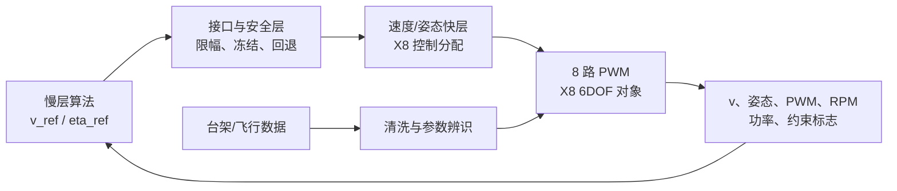

# 26isip_Aerospace

共轴八旋翼在线能耗优化协作仓库。

当前仓库的第一个可运行模块是 **上下桨转速比在线极值寻优控制（ESC）**。它用一个明确标注为“恒推力假设”的归一化功率代理对象，验证在线寻优的因果闭环、扰动鲁棒性、Simulink一致性和强化学习环境接口。它不是实机飞控、不是电子调速器（ESC），也不构成真实X8节能率或偏航稳定性结论。

## 快速开始

环境要求：MATLAB R2022b；运行Simulink模型需要 Simulink；运行RL接口需要 Reinforcement Learning Toolbox。

```matlab
cd modules/ratio_esc
START_HERE                 % 打开中文交互演示面板
run_demo                   % 导出A--E阶段的结果图和动画
run_acceptance             % 运行自动验收并写出实际报告
qa_ui                      % 检查交互面板、播放、暂停与导出
```

在交互面板中，从“C 微扰观察”开始，再切到“D 在线ESC”。播放展示的是已经完成的因果仿真日志回放；仿真本身每一步只使用当前和过去的测量功率。

## 当前成果

- 上下桨转速比定义为 `eta = Omega_upper / Omega_lower`，默认测试范围为 `[0.75, 1.25]`。
- 完成静态对象、固定参考反馈、微扰观察、完整在线ESC和RL环境接口五个阶段。
- 完成MATLAB离散实现与原生Simulink离散模型的一致性验证。
- 完成12项单元测试和35组验收场景：无噪声三初值、2%测量噪声、0.5 s延迟、工况变化及RL完整回合。
- 已验证的代理模型结果：2%噪声叠加0.5 s延迟时10个随机种子均通过3%最终超额功率阈值；具体口径见 [验收报告](docs/evidence/acceptance-report.md)。

## 飞控验证平台：当前进度

仓库现已加入与 `ratio_esc` 并行的 PX4 X8 Simulink 验证平台线。它的角色是把后续确定的慢层算法安全地接入飞控快层，并把台架/飞行数据回灌以校准模型；它**尚未**把当前转速比 ESC 接入飞控。



- 阶段 0 已完成：`air.slx` 已更新并成功仿真 0--10 s（10001 样本）；结构与端口已导出。
- M0-A 正在进行：`air_spare.slx` 已记录速度、最终 8 路 PWM 和当前植株映射的 RPM 估算；功率/能耗、约束总线、基线配置和速度闭环仍待完成。
- `modules/ratio_esc` 仍是恒推力假设下的代理对象原型；接入真实 X8 前，必须先完成功率测量和受约束控制分配。

完整路线、阶段门槛和当前文件清单见 [开发状态](docs/DEVELOPMENT_STATUS.md)、[执行路线](docs/interfaces/PROJECT_EXECUTION_ROADMAP.md) 与 [模型说明](models/px4_x8/README.md)。


## 目录

```text
modules/ratio_esc/       可运行MATLAB、Simulink与RL接口模块
models/px4_x8/           已验证的 X8 基线与 M0-A 观测快照
integration/air_esc/     慢层算法接入与安全层（预留）
harness/                 场景、指标与验收入口（预留）
docs/COLLABORATION.md    模块边界、接口和协作约定
docs/DEVELOPMENT_STATUS.md 当前完成项、局限与下一步
docs/evidence/           已核验的报告、过程图和模型结构图
```

## 协作原则

- 控制器只能接收测量功率、实际转速比、采样时间和有效性标志；完整功率曲线、真实最优点及解析梯度不得传入控制器或RL观测。
- 物理对象升级应替换 `power_map`、`plant_advance` 和 `measure`，不应修改ESC的因果接口。
- 不提交 `slprj`、`.slxc`、临时动画帧、重复日志或本地自动保存文件；需要共享的证据放入 `docs/evidence`。
- 提交前运行 `run_acceptance`。涉及面板或导出的修改，再运行 `qa_ui`。

详细的接口和可并行认领项见 [协作说明](docs/COLLABORATION.md)，当前状态与已知局限见 [开发状态](docs/DEVELOPMENT_STATUS.md)。
