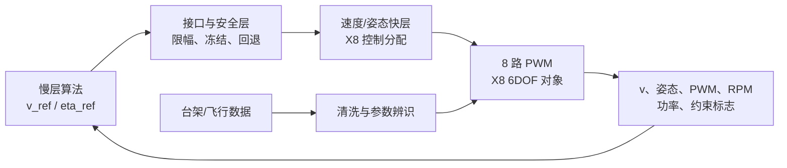

# 26isip_Aerospace

共轴八旋翼在线能耗优化协作仓库。

仓库包含**优化算法线**的三个可运行模块与**验证平台线**的 PX4 X8 仿真平台：上下桨转速比在线极值寻优（`ratio_esc`）、平飞速度在线极值寻优（`speed_esc`）、速度基线之上的 TD3 残差修正（`speed_rl_residual`），以及用于把慢层算法安全接入飞控快层的 `models/px4_x8`。所有模块当前都使用明确标注的**虚拟/代理功率对象**：它们不是实机飞控、不是电子调速器（ESC），也不构成真实 X8 节能率或偏航稳定性结论。

## 技术路线：四个模块的关系

```text
第 1 层  转速比 ESC      ratio_esc          优化 η = Ωu/Ωl（恒推力代理）        已完成验收
第 2 层  平飞速度 ESC    speed_esc          优化 v_ref（η=1，虚拟功率曲线）      已完成验收（算法线）
第 3 层  残差速度 RL     speed_rl_residual  v_ref = guard(v_base + Δv)，TD3      代理对象预研
第 4 层  平台接入        models/px4_x8      M0-C 起把慢层算法接入飞控快层        M0-A/M0-B 完成，M0-C 进行中
```

- 第 1、2 层是两个单变量 ESC：优化变量不同（η 与 v），代理对象与验收口径相互独立，结论不可互相搬用。
- 第 3 层在第 2 层基线之上叠加学习残差，应对不规则风场工况；属于算法线预研，不接入平台。
- 第 4 层是验证平台线：M0-C 将按 `docs/interfaces/M0C_SPEED_ESC.md` 采用 `ratio_esc` 内核（速度语义映射）接入；`speed_esc` 的回归估计器是后续内核替换候选。**算法线与平台线尚未集成。**



## 快速开始

环境要求：MATLAB R2022b；运行 Simulink 模型需要 Simulink；运行 RL 接口需要 Reinforcement Learning Toolbox。

```matlab
% 转速比 ESC（第一个模块）
cd modules/ratio_esc
START_HERE                 % 打开中文交互演示面板
run_demo                   % 导出A--E阶段的结果图和动画
run_acceptance             % 运行自动验收并写出实际报告
qa_ui                      % 检查交互面板、播放、暂停与导出

% 平飞速度 ESC
cd ../speed_esc
START_HERE                 % 中文面板（V1静态/V2速度响应/V3噪声延迟变化）
run_speed_demo             % 两类曲线×三版本与解调对照
run_speed_acceptance       % 单元、Python复现、Simulink一致性与74场景性能验收
qa_speed_ui                % 面板回调与截图检查

% 残差速度 RL
cd ../speed_rl_residual
START_HERE                 % 圆周+正弦风接口演示（不训练）
run_checks(false)          % 单元测试、适配器契约与20个不规则风种子
run_checks(true)           % 额外执行1回合TD3训练冒烟
```

## 当前成果

### 转速比 ESC（modules/ratio_esc）

- 上下桨转速比定义为 `eta = Omega_upper / Omega_lower`，默认测试范围为 `[0.75, 1.25]`。
- 完成静态对象、固定参考反馈、微扰观察、完整在线ESC和RL环境接口五个阶段。
- 完成MATLAB离散实现与原生Simulink离散模型的一致性验证。
- 完成12项单元测试和35组验收场景：无噪声三初值、2%测量噪声、0.5 s延迟、工况变化及RL完整回合。
- 已验证的代理模型结果：2%噪声叠加0.5 s延迟时10个随机种子均通过3%最终超额功率阈值；具体口径见 [验收报告](docs/evidence/acceptance-report.md)。

### 平飞速度 ESC（modules/speed_esc，2026-09-01 并入）

- 整合同事 Python 速度寻优方案（V1 静态 / V2 一阶速度响应 / V3 噪声+延迟+最优速度跳变）与转速比工程，只优化平飞速度、配比固定 1。
- 梯度估计以**窗口最小二乘回归**为主（约一个微扰周期）、经典同频解调为对照；关键修正包括功率-速度-时间三元组 FIFO 配对与完整窗口预热。
- 14 项单元测试、14 组原 Python 逐样本复现（最大误差 5.33e-15）、6 组 Simulink 一致性（最大差 1.25e-14）通过；正式种子 74 场景功率指标 74/74、速度定位 63/74（未达标场景如实列出）。
- 证据见 [docs/evidence/speed_esc/](docs/evidence/speed_esc/)。

### 残差速度 RL（modules/speed_rl_residual，2026-09-01 并入）

- 以速度基线（固定值 / ESC / 解析式）为底层，TD3 学习 `[-3,3] m/s` 残差，策略外 guard 硬约束（边界 `[2,15] m/s`、限速、反馈失效冻结）。
- 不规则风场（OU 有色噪声+阵风）、电池模型与直线/圆周轨迹代理；观测仅由带时间戳/噪声/延迟/有效标志的测量构成，真值只给评价器。
- 11 项单元测试与适配器契约通过；20 个未见不规则风种子零硬约束违规；可观测风解析残差 19/20 种子优于固定基准（约 -1.25% 代理功率）；TD3 候选恒定风 -3.02%、不规则风尚未胜出（0–1/20，如实记录为训练起点）。
- 证据见 [docs/evidence/speed_rl_residual/](docs/evidence/speed_rl_residual/)。

### 飞控验证平台（models/px4_x8）

与算法模块并行开发，角色是把后续确定的慢层算法安全地接入飞控快层，并把台架/飞行数据回灌以校准模型；它**尚未**接入任何优化模块。

- 阶段 0 已完成：`air.slx` 已更新并成功仿真 0--10 s（10001 样本）；结构与端口已导出。
- M0-A 已完成：速度、8 路 PWM、RPM 估算、`P_est`/`E_est`、8 位约束标志、35 维统一日志总线与固定基线模式；观测层与原基线逐样本零差异。
- M0-B 已完成（2026-09-01 复核修复后再验收通过）：受保护速度闭环与安全回退，逐位故障注入全链保护通过。
- M0-C（速度在线 ESC 接入）方案已定稿：见 [docs/interfaces/M0C_SPEED_ESC.md](docs/interfaces/M0C_SPEED_ESC.md)。

完整路线、阶段门槛和当前文件清单见 [开发状态](docs/DEVELOPMENT_STATUS.md)、[执行路线](docs/interfaces/PROJECT_EXECUTION_ROADMAP.md) 与 [模型说明](models/px4_x8/README.md)。


## 目录

```text
modules/ratio_esc/           转速比在线ESC：可运行MATLAB、Simulink与RL接口模块
modules/speed_esc/           平飞速度在线ESC：回归梯度估计、Python对齐与74场景验收
modules/speed_rl_residual/   残差速度RL：TD3残差修正、风场/电池/轨迹代理与公平评估
models/px4_x8/               PX4 X8验证平台：基线、M0-A/M0-B快照与M0-C计划
integration/air_esc/         慢层算法接入与安全层（预留）
harness/                     场景、指标与验收入口（预留）
docs/COLLABORATION.md        模块边界、接口和协作约定
docs/DEVELOPMENT_STATUS.md   当前完成项、局限与下一步
docs/evidence/               已核验的报告、过程图和模型结构图（含 speed_esc、speed_rl_residual 子目录）
AGENTS.md                    面向AI代理与协作者的工作守则（必读）
```

## 协作原则

- 控制器与 RL 观测只能接收测量功率、实际被控量（转速比或平飞速度）、采样时间和有效性标志；完整功率曲线、真实最优点及解析梯度不得传入控制器或 RL 观测。
- 物理对象升级应替换各模块的 `power_map`/`plant_*`/`measure` 一侧，不应修改 ESC 的因果接口。
- 不提交 `slprj`、`.slxc`、临时动画帧、重复日志或本地自动保存文件；需要共享的证据放入 `docs/evidence`（默认仿真输出可在本地用各模块验收脚本重建）。
- 提交前运行对应模块的验收脚本（`run_acceptance` / `run_speed_acceptance` / `run_checks`）。涉及面板或导出的修改，再运行对应 `qa_*`。

详细的接口和可并行认领项见 [协作说明](docs/COLLABORATION.md)，当前状态与已知局限见 [开发状态](docs/DEVELOPMENT_STATUS.md)，工作守则见 [AGENTS.md](AGENTS.md)。
