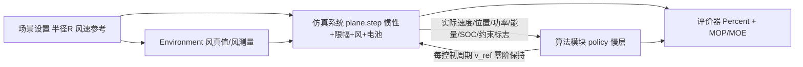

# 仿真集成与验收路线：Task 1 开环 / Task 2 闭环

版本：v0.1（建议/Proposed，门槛数值均为建议值，待 R0 确认）
日期：2026-09-05
依据：2026-09-05「无人机仿真系统接口定义与验收标准研讨会」决议（接口标准、两阶段开发策略、Percent 验收指标、文档编写规范）

项目组：周航正、霍奕茗、于跃、叶安、王健祺
文件负责人：周航正（会议指定：发言人2、发言人1）
本次贡献：ZCode（依据会议决议与执行路线既有工作包成文）
审核：待项目组审核
AI协助：ZCode（全文起草，待人工复核精简）

## 1 目的与权威关系

- 本文件是**对外验收视图**：给出技术路线、任务分解、里程碑与验收标准。
- 内部阶段与放行门槛的唯一基线仍是 [`PROJECT_EXECUTION_ROADMAP.md`](PROJECT_EXECUTION_ROADMAP.md)；本文的 Task 1 / Task 2 是其既有工作（ENV 收口、harness↔Plane 对接、M3 统一 Plane 复跑、统一 Harness 汇合）的验收包装，**不另立内部阶段顺序**。
- 接口标准见 [`interfaces/SIM_ALGO_INTERFACE.md`](interfaces/SIM_ALGO_INTERFACE.md)。

## 2 技术路线总览

要点（会议决议）：

1. **控制权**：算法侧只输出目标速度；仿真侧执行并回传实际状态；物理限制（惯性、限幅、风扰）由仿真侧保证。
2. **解耦**：两侧独立开发，仅以接口契约耦合；数据定义在接口层面保持一致。
3. **验证等级**：当前处于执行路线 §0.6 的 V1（桌面模型仿真）；V2 SITL / V3 台架 / V4 实飞不在本轮验收范围。

### 2.1 算法侧信息结构三步走（功率-空速曲线 × 风）

算法模块对**功率-空速曲线**与**风**两类先验的假设是算法技术路线的主轴：每一步只放宽一个假设，前一步结果是后一步的基线与上界，相邻两步的 Percent 差值即该信息的价值。

| 步 | 功率-空速曲线 | 风信息 | 算法形态 | 可用信息 | 性质 | 对应阶段 | 对应既有模块 |
|---|---|---|---|---|---|---|---|
| ① | 已知（名义图 `P_nom(v_air)`） | 已知（风参考 = 风真值） | 解析最优调度 `v*(t)`，开环执行 | 名义图 + 风参考 | 规划验证 / Oracle 上界，**非因果在线策略** | Task 1 | `wind_field_sched` 解析调度 + DP 验证 |
| ② | 已知（`P_nom`，最优空速 u\* 已知） | 未知 | 风矢量在线反演 + 闭式地速调度（零探针），或滑窗 LM 风估计 + 解析调度 | 转圈功率调制 / 功率-速度测量 / 风测量 | 因果闭环 | Task 2 | `wind_inference_search`（2.1：恒定风 MOE 0.9945 vs known 0.9988）；`wind_field_sched` 在线版 |
| ③ | 未知（黑箱，仅逐周期查询） | 未知 | 黑箱在线寻优：ESC / qnewton / spsa / bayes / RL 残差 | 仅每周期测量面（功率、实际速度、时间戳、有效标志） | 因果闭环（**默认在线口径**） | Task 2 | `speed_esc`、`adaptive_search`、`speed_rl_residual`；2.2 规划（曲线未知路线，RL 方案待确认） |

约定：

1. 因果红线（ADR-004、接口文档 §4.2）下，第③步是正式在线策略的默认口径；第①步允许使用名义图与风参考做开环规划与上界标定，其结果**不得写成在线策略成果**（与状态页「Oracle 结果不得写成在线策略结果」一致）。
2. 运行对象始终是 `P_hidden`（可含风、电池、执行动态与参数偏差）：第①②步「曲线已知」指算法侧持有名义图 `P_nom`，不代表运行对象与名义图一致——两者偏差正是 Percent 的来源之一。
3. 每步报告 Percent，并解释相邻步差值：①−② 为完美风信息相对在线估计的价值；②与「完全不知风」之差为风估计本身的价值。代理口径参考值（1 小时窗 MOE，见 `wind_field_sched` 证据）：已知风 1.000 / 在线估计 0.974 / 不知风 0.938。
4. 编号对应：算法线本地任务线 1.x / 2.x 与本阶梯的对应关系——1.11 `wind_semantics_correction` 为「空速 = 地速 − 风」语义参考实现（接口文档 §6 符号口径）；2.1 `wind_inference_search` 即第②步；2.2（曲线未知，待启动）即第③步。

## 3 核心验收指标：Percent

**Percent = 100 × (E_actual − E_pred) / E_pred**

| 量 | 定义 | 来源 |
|---|---|---|
| `E_pred` | 算法预测的最优能耗：按名义功率图 `P_nom` 与场景风参考预测最优调度 `v*(t)` 后积分 | 算法侧 |
| `E_actual` | 仿真实际电能耗（回合终值） | 仿真回传 `energy_electrical_J` |

- 正值 = 实际比预测多耗；负值 = 少耗。Task 1 用 `|Percent|` 衡量"预测—仿真"一致性；Task 2 用有符号 Percent 与开环基线配对比较。
- 与既有口径的关系：`energyExcessPercent = 100(E − Emin)/Emin`、`MOE_energy = Emin/E_actual`（`Emin = Pmin·T` 先验理论下界）。当预测最优可达时 `E_pred ≈ Emin`，Percent ≈ energyExcessPercent；**两者同时报告，不混用**。
- 报告要求：预注册场景 × ≥20 种子，报告均值 / 最差 / 抖动（遵守 `ACCEPTANCE_AUTOMATION_RULES.md` 第 3 条）。

## 4 阶段 S0：文档与概念冻结（9/5–9/7）

| # | 任务 | 交付物 | 负责人 |
|---|---|---|---|
| S0.1 | 文档组评审：本文件 + `SIM_ALGO_INTERFACE.md` + 新版 `AGENTS.md` | 评审意见与定稿 | 周航正（会议指定） |
| S0.2 | R0 概念确认：ADR-001 / ADR-004，接口字典 0.3 → 1.0 | 冻结记录 | 周航正组织 |
| S0.3 | 验收场景矩阵预注册（风模式 × R × 种子；默认对齐任务 7 口径：R=100、`windAmp=2 / windOmega=0.08 / windBias=3`） | 场景清单入库 | 待认领 |

## 5 Task 1（开环，9/8–9/11）：基础功能验证

**定义**：开环控制——策略不使用回传测量做调整，按预设速度序列直跑仿真；验证接口、物理限制与数据一致性。信息结构对应三步走**第①步**（曲线已知、风已知）。

| # | 任务 | 对应既有工作线 |
|---|---|---|
| T1.1 | ENV 收口：PathCommand / WindTruth / WindMeasurement 统一，关闭 `wind_field_sched` 加号约定适配 | ENV 线（状态页优先级 3） |
| T1.2 | harness↔Plane 对接：经 P4 适配器把 `plane.step` 接入 harness，替换 aircraft 代理 | Plane 线（优先级 2，汇合 R1/R2 载体） |
| T1.3 | 开环策略接入（三步走第①步）：`fixed`（固定 `openLoopV`）与 `nominal_sched`（曲线已知 + 风已知，解析调度 `v*(t)`）经统一 policy 插槽 | 算法线（优先级 4 前半） |
| T1.4 | 一致性与物理校验：`SIM_ALGO_INTERFACE.md` §6 清单 + P0–P4 六门槛 + 负向测试全绿 | — |
| T1.5 | Percent 落地：评价器输出 `fixed` / `nominal_sched` 两臂 Percent 报告 | 统一 Harness（优先级 5） |

**验收判据**（建议值，待 R0 确认）：

1. 接口符合性与物理门槛 100% 通过（硬性）；
2. Percent 报告：两臂 × ≥20 种子，含均值 / 最差 / 抖动（硬性）；
3. 参考带：`nominal_sched` 的 `|Percent|` 中位数 ≤ 5%（建议值；超带需归因说明，不自动 FAIL）；
4. 零硬约束违规（`constraint_flags` 硬位）。

## 6 Task 2（闭环，9/12–9/18）：基于历史数据的闭环优化

**定义**：闭环控制——策略根据**上一圈（lap）历史测量数据**在圈间调整速度策略；圈内连续优化算法可并行评估。覆盖三步走**第②步**（曲线已知、风未知）与**第③步**（曲线未知、风未知）。

| # | 任务 | 说明 |
|---|---|---|
| T2.1 | 圈级历史接口：按 `path_phase_rad` 切圈，索引上一圈的速度 / 功率 / 位置 / 风测量，供圈间更新 | 仿真侧提供相位与测量历史 |
| T2.2 | **第②步接入**：曲线已知、风未知——在线风估计 ŵ + 解析调度（含观测性激励），因果闭环 | `wind_field_sched` 在线版适配 |
| T2.3 | **第③步接入**：曲线未知、风未知——黑箱在线寻优：ESC（连续）、qnewton（当前推荐）、圈级重规划（lap-batch）；guard 硬约束保持策略外 | 算法线（默认在线口径） |
| T2.4 | 配对横评：同场景同种子，三步策略 ①/②/③ 与 `fixed` 配对比较；M3 v/eta 协同在统一 Plane 复跑（对应汇合 R4） | M3 独立复验先行 |
| T2.5 | 学术表达材料（9/19） | 结论边界遵守 `DEVELOPMENT_STATUS.md` |

**验收判据**（建议值，待 R0 确认）：

1. 三步 Percent 全部报告：①为上界参照；同时给出 ①−②（风信息价值）与 ②−③（曲线先验价值）的多种子差值分布；
2. 预注册场景上 `Percent(③) < Percent(fixed)` 的胜出率 ≥ 70%（建议值，待定）；② 至少不劣于 `fixed`；
3. 至少一个闭环策略（②或③）的 Percent 优于 `nominal_sched` 开环，或给出归因——任务 7 负结果口径（风摆幅下开环基线很强）允许**如实报告未胜出**，不以输赢倒逼调参；
4. 零硬约束违规；安全冻结 / 回退链经注入测试可用；
5. 配对结论按 ADR-003 分层报告（功能实现 / 验收基础设施 / 环境限制 / 文档证据）。

## 7 里程碑

| 日期 | 里程碑 |
|---|---|
| 9/7 | 文档冻结 + R0 确认完成 |
| 9/11 | Task 1（开环）验收通过 |
| 9/18 | Task 2（闭环）验收通过 + 汇报口径定稿 |
| 9/19 | 学术表达 |

## 8 风险与既知限制

- **R2022b 堆损坏**：单进程长序列批量验收使用分段模式（沿用 `verify_m2_round4_closure` 经验）。
- **开环基线很强**：任务 7 表明 R=50–150 空速物理下无因果在线策略胜过开环固定速度；Task 2 判据 2 已按"如实报告"设计。
- **代理对象等级**：功率对象为 proxy、未经实测校准；所有 Percent 结论仅限 V1 桌面仿真等级，不得外推真实节能。

## 9 变更管理

本文件与 `SIM_ALGO_INTERFACE.md` 由 R0 冻结；此后任务增删经 worklog + 状态页登记，门槛数值变更须在评审记录中留痕。
