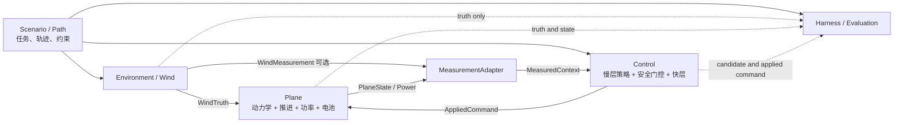

# Wind-Plane-Control逻辑架构

版本：0.3
日期：2026-09-03
状态：建议基线

项目组：周航正、霍奕茗、于跃、叶安、王健祺
文件负责人：周航正
主要撰写：周航正（架构要求）、Codex（整理成文）
技术依据：霍奕茗（Plane/六自由度基础）、于跃（数据/PX4方向）、叶安（Control/Simulink平台）、王健祺（场景/评价方向）及仓库现有成果
审核：待项目组审核、待指导教师确认
AI协助：Codex（架构整理、接口一致性检查、现状对齐、用户接口草图修订）

## 先看结论

- **Scenario/Path**负责“任务要求飞什么轨迹”，不生成飞机实际航向。
- **Environment/Wind**只负责“世界坐标中哪里、何时有什么风”，不直接生成空速或功率。
- **Plane**负责“无人机受到风和控制后怎样运动、耗多少电”，并产生实际航向、地速、空速和功率。
- **Control**根据测量信息给出地速和转速比参考；RL只是其中一种慢层策略。
- **Evaluation**只看日志、算指标，不偷偷把最优答案告诉控制器。

## 1. 为什么这样拆

这样拆以后，做风场的人不必等待完整飞控，做算法的人也不必等待真实硬件。大家只要遵守同一套输入输出，就可以先用简化模型并行开发，最后再替换成正式模块。

## 2. 修正后的系统上下文



这张图对手写草图作了四点修正：

1. Environment输出风场真值和可选的风测量，不输出飞机航向、地速或空速。
2. Plane根据控制命令和风场产生实际航向、地速、空速、功率与约束状态。
3. Control输出的是 `v_ref/eta_ref`；实际速度由快层和Plane共同形成。
4. Harness/Evaluation可以读取真值作评分，但不向控制回路注入“标准答案”。

## 3. 逻辑组件

### 3.0 Scenario/Path：任务与轨迹

责任：定义直线/圆周任务、圆心/半径、方向、目标高度、运行时长、速度约束和评价窗口，并根据当前位置给出路径相位、切向量、法向量和轨迹误差参考。

不负责：生成风、模拟飞机响应、计算最优速度或功率。

### 3.1 Environment/Wind：环境风场

责任：

- 根据时间和位置生成或回放世界NE坐标系风矢量；
- 模拟风测量噪声、延迟、采样率和缺测；
- 保证随机场景可由种子复现。

不负责：计算航向、地速、空速、功率或最优速度，也不直接触发控制动作。

### 3.2 Plane：飞行器与能源对象

责任：

- 接收风环境和经安全门控的控制参考；
- 推进动力学、速度/轨迹/姿态状态；
- 计算或测量功率、电量、RPM/PWM和约束状态；
- 明确功率来源和模型版本；
- 为纯MATLAB、Simulink、SITL和日志回放提供统一适配器。

不负责：读取完整未来场景、替优化器选择最优参考。

### 3.3 Control：快慢层控制

```text
慢层参考生成器（一次只启用一种模式）
fixed | nominal_sched | ESC | RL residual
             |
             v
接口与安全门控
范围、变化率、冻结、回退、状态机
             |
             v
快层控制
轨迹/速度PID、姿态控制、X8控制分配
```

慢层只输出 `v_ref` 和后续 `eta_ref`。安全门控独立于ESC/RL内核，所有候选策略必须使用相同门控。

四种模式的角色不同：`fixed`是最低复杂度基线；`nominal_sched`使用公开名义功率图和当前可用风测量；`ESC`只根据实际速度与功率反馈搜索；`RL residual`在 `v_base` 上输出小修正。完整隐藏对象和未来真实风只给Evaluation，不给任何可部署模式。

### 3.4 RL：慢层策略插件，不是第五个物理组件

RL位于Control的慢层策略插槽中，推荐采用残差形式：

```text
nominal_sched或ESC -> v_base
MeasuredContext历史 -> RL -> delta_v
v_candidate = v_base + delta_v
SafetyGuard -> v_ref_applied
```

RL不直接读取WindTruth、隐藏功率图和未来风，不直接输出姿态、推力或PWM。当前仓库只保留RL接口、候选训练和负结果；统一Plane和Harness完成、强基线成立后，再按ADR-002决定是否晋级。

### 3.5 Evaluation：Harness与证据

责任：

- 批量运行确定场景和配对基线；
- 记录配置、版本、随机种子和接口日志；
- 计算MoP/MoE并检查验收门槛；
- 输出机器可读结果和面向汇报的可视化；
- 管理代理、校准和实测证据等级。

不负责：在线为策略提供真实最优点、未来风或验收答案。

## 4. 运行时数据流

推荐的离散更新顺序为：

```text
1. Scenario.step(t, position)       -> PathCommand
2. Wind.step(t, position)           -> WindTruth / WindMeasurement
3. MeasurementAdapter.sample(...)   -> MeasuredContext
4. SlowPolicy.step(context)          -> candidate v_ref / eta_ref
5. SafetyGuard + FastControl         -> AppliedCommand
6. Plane.step(windTruth, command)    -> next PlaneState / Power
7. Evaluation.record(...)           -> append-only evidence
```

实现可以采用等价的同步离散顺序，但必须记录一个信号对应的采样时刻，避免把未来样本错误送入控制器。

建议时标：

| 环节 | 建议周期 | 说明 |
|---|---:|---|
| Plane内部积分 | 0.004-0.05 s | 由Simulink/PX4对象决定 |
| 快层控制 | 毫秒至0.05 s | 保证稳定和轨迹跟踪 |
| ESC测量/更新 | 0.05 s量级 | 与现有算法接口兼容 |
| 慢层参考决策 | 0.5-1 s或更慢 | 防止与快层争用 |
| Harness评价 | 离线/窗口化 | 不进入控制因果链 |

## 5. 状态与回退

统一控制状态建议为：

```text
disabled -> warmup -> active -> frozen -> fallback
```

- `disabled`：优化关闭，固定安全基线。
- `warmup`：收集有效功率和状态窗口，不更新中心参考。
- `active`：允许慢层更新。
- `frozen`：短暂数据或约束异常，保持最后安全参考。
- `fallback`：持续异常，回到固定基线；恢复须满足滞回和稳定时间。

所有状态切换都应记录原因码、触发时刻和恢复时刻。

## 6. 仓库映射

| 架构组件 | 当前仓库资产 | 主要缺口 |
|---|---|---|
| Scenario/Path | 各风场模块中的直线、圆周和相位函数 | 需要从Wind中拆出统一 `PathCommand` 和任务约束 |
| Environment/Wind | `modules/wind_field_sched`及圆周、正弦和正交风场模块 | 统一为 `WindSample`；修正局部 `u=v*t+w` 与公共 `v_air=v_ground-wind` 的符号适配 |
| Plane | `models/px4_x8`、速度/转速比代理对象 | P0--P4统一对象、`P_nom/P_hidden/P_meas`分层、电池/SOC和校准来源 |
| Control | `modules/speed_esc`、`modules/ratio_esc`、平台M0-C/M1/M2 | 四种策略的同接口适配、M3交替协同及统一Plane复验 |
| Evaluation | `harness`、`docs/evidence`、各模块验收脚本 | 指标层已可用，尚未接入同一WPC闭环 |
| Future RL | `modules/speed_rl_residual`、`modules/speed_rl_pytorch` | 已有代理环境训练预研；平台接入仍受ADR-002约束 |

平台唯一执行路线仍为 [`../PROJECT_EXECUTION_ROADMAP.md`](../PROJECT_EXECUTION_ROADMAP.md)。本架构提供跨模块职责边界，公共字段语义以 [`04_interface_dictionary.md`](04_interface_dictionary.md) 为准；阶段接线和验收仍由路线图及 `docs/interfaces/M*.md` 管理。

## 7. 并行协作边界

| 责任 | 建议负责人 | 独立交付 |
|---|---|---|
| 架构、算法适配、总装和展示 | 周航正 | 冻结问题与接口；把固定/名义调度/ESC接成同一策略插槽；WPC一键入口和最终展示 |
| Plane物理和能源模型 | 霍奕茗 | `reset/step`对象、空/地速、执行动态、`P_nom/P_hidden/P_meas`、电池和来源 |
| MeasurementAdapter、PX4/QGC和回放 | 于跃 | 信号字典、时间对齐、有效性、风/功率测量退化、SITL/日志映射 |
| 快层控制、X8分配与M3调度 | 叶安 | M2分配器、安全门控、双变量仲裁、Simulink接入与平台回归 |
| Scenario/Environment和MoE/MoP | 王健祺 | PathCommand、统一NE风、场景种子、指标计算和成对测试报告 |

RL当前不单独占用一名成员的主线：周航正只维护策略插槽和信息边界，现有候选由仓库保留。通过R5后再从算法线明确训练负责人和算力计划。

同一个 `.slx` 稳定模型在同一时间只由一条工作线修改。其他成员通过脚本、参数和接口适配器交付，避免二进制冲突。

## 8. 最后怎样展示给老师看

最终演示建议使用同一份运行日志驱动四个同步区域：

1. **Wind**：NE风矢量、沿程/侧风分量、数据有效性。
2. **Plane**：直线或圆周轨迹、姿态、地速/空速、八电机状态和功率。
3. **Control**：模式、`v_base`、`v_ref`、`eta_ref`、冻结/回退原因。
4. **Evaluation**：平均功率、累计能量、轨迹误差、约束和相对基线结果。

可视化只消费 `EvaluationRecord`，不得建立一条绕过接口的第二套数据链。

## 9. 怎样才算真的完成架构

当下列条件满足时，Wind-Plane-Control架构才算落地，而不只是画图：

1. Scenario、Wind、Plane、Control和Evaluation五类组件能分别用正式实现或Mock替换。
2. 同一场景可在纯MATLAB、Simulink和日志回放适配器间切换。
3. 固定、ESC和候选RL共用安全门控与Harness。
4. 所有信号有单位、坐标、时间戳、有效性和来源。
5. 一键运行能生成配置、日志、指标、判定和展示数据。
