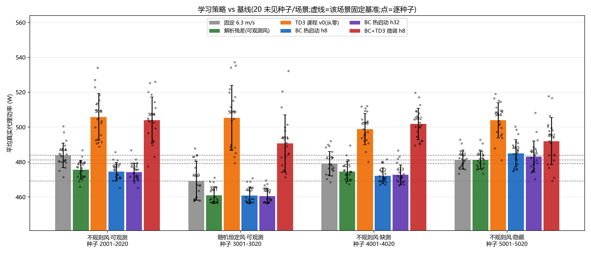
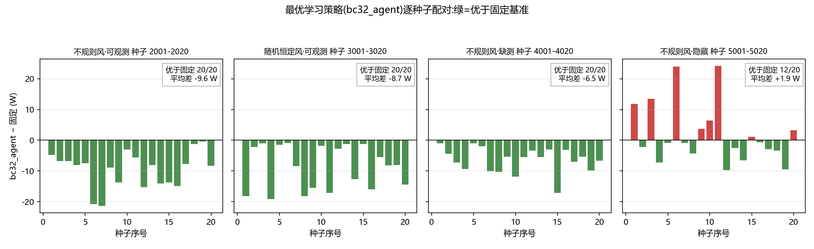
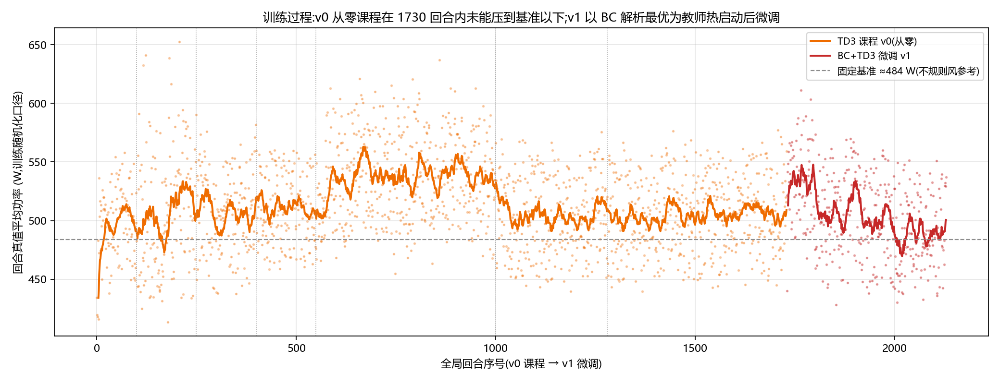

> 项目组:周航正、霍奕茗、于跃、叶安、王健祺
> 文件负责人:待项目组确认
> 技术贡献:ZCode(训练执行、图表与报告生成,AI 协助);负责人待补
> 审核:待项目组审核
> 数据来源:modules/speed_rl_pytorch(环境与 MATLAB 对拍一致)

# 残差速度 RL 新一轮训练结果报告(2026-09-02)

## 设置
- 环境:speed_rl_residual 合成适配器的 Python 逐行移植,与 MATLAB **公式级一致**(无风/恒定/正弦确定性场景 12 位小数逐位相同;不规则风 20 种子统计一致,MATLAB 侧 480.26/474.23 W 复现了仓库证据值)。
- 训练设备:RTX 4060 Laptop(PyTorch,torch 2.5.1+cu121)。
- 三个策略版本:
  1. **TD3 课程 v0**:7 阶段课程从零训练 1730 回合(20.8 万步),超参镜像仓库 make_agent.m;
  2. **BC 热启动**:以真值风解析最优残差为教师,混合 9 种场景 (不规则/恒定/正弦 × 可观测/缺测/隐藏)监督训练(仅用于生成监督数据,部署时网络只见测量);
  3. **BC+TD3 微调 v1**:BC 初始化 + 小噪声(σ=0.12)、低学习率(3e-4)TD3 微调 400 回合。
- 评估:4 场景 × 20 **未见种子**(训练种子 1000+/30000+,评估 2001-2020/3001-3020/4001-4020/5001-5020,零重叠)。

## 核心结果(平均真实代理功率,相对固定 6.3 m/s 基准)

| 场景                             | 策略               |   平均功率W |   相对固定% | 优于固定   |   续航min |   违规 |
|:---------------------------------|:-------------------|------------:|------------:|:-----------|----------:|-------:|
| 不规则风·可观测 种子 2001-2020   | 固定 6.3 m/s       |      483.84 |        0    | 0/20       |     18.61 |      0 |
| 不规则风·可观测 种子 2001-2020   | 解析残差(可观测风) |      475.58 |       -1.71 | 19/20      |     18.93 |      0 |
| 不规则风·可观测 种子 2001-2020   | TD3 课程 v0(从零)  |      505.84 |        4.55 | 2/20       |     17.8  |      0 |
| 不规则风·可观测 种子 2001-2020   | BC 热启动 h8       |      474.59 |       -1.91 | 20/20      |     18.97 |      0 |
| 不规则风·可观测 种子 2001-2020   | BC 热启动 h32      |      474.28 |       -1.97 | 20/20      |     18.98 |      0 |
| 不规则风·可观测 种子 2001-2020   | BC+TD3 微调 h8     |      503.98 |        4.16 | 2/20       |     17.87 |      0 |
| 随机恒定风·可观测 种子 3001-3020 | 固定 6.3 m/s       |      469.15 |        0    | 0/20       |     19.19 |      0 |
| 随机恒定风·可观测 种子 3001-3020 | 解析残差(可观测风) |      460.93 |       -1.75 | 20/20      |     19.53 |      0 |
| 随机恒定风·可观测 种子 3001-3020 | TD3 课程 v0(从零)  |      505.34 |        7.71 | 1/20       |     17.83 |      0 |
| 随机恒定风·可观测 种子 3001-3020 | BC 热启动 h8       |      460.85 |       -1.77 | 20/20      |     19.53 |      0 |
| 随机恒定风·可观测 种子 3001-3020 | BC 热启动 h32      |      460.44 |       -1.86 | 20/20      |     19.55 |      0 |
| 随机恒定风·可观测 种子 3001-3020 | BC+TD3 微调 h8     |      490.65 |        4.58 | 0/20       |     18.36 |      0 |
| 不规则风·缺测 种子 4001-4020     | 固定 6.3 m/s       |      479.1  |        0    | 0/20       |     18.79 |      0 |
| 不规则风·缺测 种子 4001-4020     | 解析残差(可观测风) |      474.55 |       -0.95 | 19/20      |     18.97 |      0 |
| 不规则风·缺测 种子 4001-4020     | TD3 课程 v0(从零)  |      498.84 |        4.12 | 0/20       |     18.05 |      0 |
| 不规则风·缺测 种子 4001-4020     | BC 热启动 h8       |      472.16 |       -1.45 | 20/20      |     19.06 |      0 |
| 不规则风·缺测 种子 4001-4020     | BC 热启动 h32      |      472.64 |       -1.35 | 20/20      |     19.04 |      0 |
| 不规则风·缺测 种子 4001-4020     | BC+TD3 微调 h8     |      501.82 |        4.74 | 0/20       |     17.94 |      0 |
| 不规则风·隐藏 种子 5001-5020     | 固定 6.3 m/s       |      481.2  |        0    | 0/20       |     18.71 |      0 |
| 不规则风·隐藏 种子 5001-5020     | 解析残差(可观测风) |      481.2  |        0    | 0/20       |     18.71 |      0 |
| 不规则风·隐藏 种子 5001-5020     | TD3 课程 v0(从零)  |      503.91 |        4.72 | 0/20       |     17.87 |      0 |
| 不规则风·隐藏 种子 5001-5020     | BC 热启动 h8       |      484.97 |        0.78 | 10/20      |     18.56 |      0 |
| 不规则风·隐藏 种子 5001-5020     | BC 热启动 h32      |      483.07 |        0.39 | 12/20      |     18.64 |      0 |
| 不规则风·隐藏 种子 5001-5020     | BC+TD3 微调 h8     |      491.96 |        2.23 | 3/20       |     18.31 |      0 |

## 结论

1. **从零 TD3(v0)仍未胜出**:不规则风 505.8 W(+4.55%),与仓库已有候选一致;诊断显示其输出退化为与风无关的固定偏置(平均残差 −1.9 m/s,与风相关性 −0.13)——奖励信号仅占总回报约 2%,TD3 的价值估计误差淹没了真实信号。
2. **BC 热启动显著有效**:不规则可观测风 474.6 W(-1.91%,20/20 种子优于固定),**超过解析残差**(475.6 W,-1.71%,19/20);缺测场景优势更大(−1.45% vs −0.95%):解析式在缺测窗口只能回退到基线,学习策略的动作保持连续。
3. **隐藏风是真正的硬问题**:8 帧/32 帧历史下 BC 仍略差于固定(+0.78%/+0.39%)。这不是记忆长度配置问题——在功率曲线最优空速附近,功率对风的一阶敏感度为零,被动观测难以分辨风;这与平台线 ESC 需要主动激励(dither)的结论在物理上同源。
4. 全部策略零硬约束违规(guard 层有效)。

## 图

## 表述边界(ADR-002)

以上为虚拟代理对象、Python 对拍环境的结果;"学习策略超过解析残差"仅在本代理口径、可观测/缺测风场景成立,不外推真实 X8、不构成飞行结论;教师用到真值风仅发生在监督数据生成阶段,评估与部署只用测量。